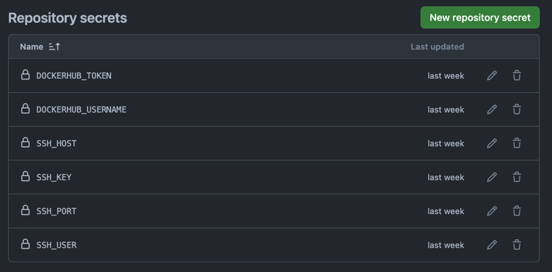

# VPS Setup
This repository is a knowledge and scripts base for setting up VPS server from the beggining.

I'm using mikr.us servers for hobby projects as cost effective learning vps platform


## Usual steps for preparing VPS server
1. Install docker (using `noobs/scripts/chce_dockera.sh`)
2. Check if docker is working (using `docker run hello-world`)
3. Install `fnm` for installing node versions. https://github.com/Schniz/fnm?tab=readme-ov-file#using-a-script-macoslinux
4. Install newest node version
5. Install `pnpm` using script from https://pnpm.io/installation#using-npm
6. Run commands on the server (for now manually)
```bash
$ docker pull marckraw/town-store-api:latest (example)
$ docker run -p 20152:20152 -d marckraw/town-store-api:latest (example)
```

## Making CI/CD able to build, push, pull and run docker images
1. https://nbailey.ca/post/github-actions-ssh/
Secrets needed in repository for github action to work: 


## Setting up docker images

### Dockerfile for NestJS

simple dockerfile with just backend without database etc

```dockerfile
FROM node:20-alpine

#ENV NODE_ENV production


# Set the working directory in the container to /app
WORKDIR /app

# Install pnpm
RUN npm install -g pnpm

# Copy package.json and package-lock.json to the workdir
COPY package*.json ./
COPY pnpm-lock.yaml ./

# Install your application's dependencies
RUN pnpm install

# Bundle your app's source code inside the Docker image
COPY . .

# Make port 20152 available outside the container
EXPOSE 20152

# Run migrations
RUN pnpm db:migrate

# Run seeders - this of course will be removed when the time come to go to production
RUN pnpm db:seed

# Start the application
RUN pnpm build

CMD [ "pnpm", "start:prod" ]
```

### Github action workflow for building and pushing docker image

Simple yet powerfull github action workflow for building and pushing docker image to docker hub

```yaml
name: Deploy NestJS App

on:
  push:
    branches: [ master ]

jobs:
  deploy:
    runs-on: ubuntu-latest
    timeout-minutes: 30

    steps:
      - name: Checkout
        uses: actions/checkout@v4

      - name: Set up QEMU
        uses: docker/setup-qemu-action@v3

      - name: Set up Docker Buildx
        uses: docker/setup-buildx-action@v3

      - name: Login to Docker Hub
        uses: docker/login-action@v3
        with:
          username: ${{ secrets.DOCKERHUB_USERNAME }}
          password: ${{ secrets.DOCKERHUB_TOKEN }}

      - name: Build and Push Docker image
        uses: docker/build-push-action@v5
        with:
          context: .
          push: true
          tags: marckraw/town-store-api:latest

      - name: Deploy to VPS
        uses: appleboy/ssh-action@v1.0.0
        with:
          command_timeout: 30m
          host: ${{ secrets.SSH_HOST }}
          port: ${{ secrets.SSH_PORT }}
          username: ${{ secrets.SSH_USER }}
          key: ${{ secrets.SSH_KEY }}
          script: |
            docker pull marckraw/town-store-api:latest
            docker stop town-store-api || true
            docker rm town-store-api || true
            docker run -d --name town-store-api -p 20152:20152 marckraw/town-store-api:latest

```
